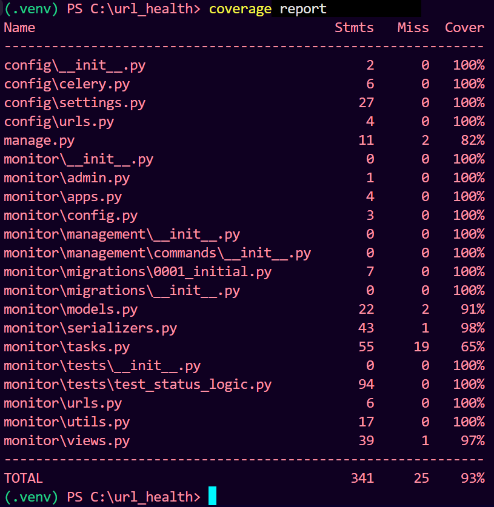
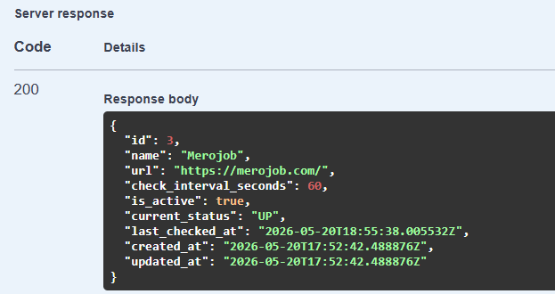
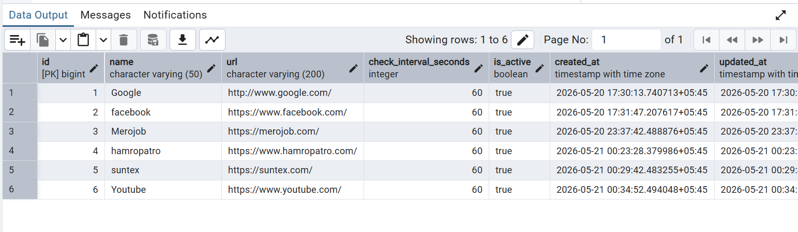
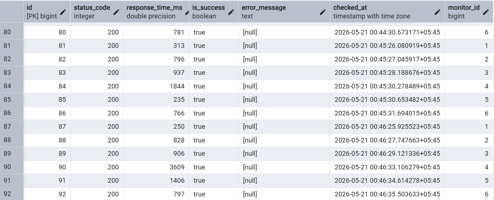

# Async URL Health Monitor

A Django application that monitors URLs asynchronously using Celery and Redis.
Users submit URL then the system periodically checks their availability, stores results,
and computes a health status from the latest checks.


## Tech Stack

| Layer | Technology |
|---|---|
| Framework | Django 4.x + Django REST Framework |
| Database | PostgreSQL |
| Task queue | Celery |
| Message broker | Redis |
| HTTP client | requests |

---

## Project Structure

```
url_health/
├── config/
│   ├── __init__.py          # loads Celery on startup
|   ├── asgi.py
│   ├── celery.py            # Celery app instance + Beat schedule
│   ├── settings.py
│   └── urls.py
├── monitor/
│   ├── management/
│   │   └── commands/
│   │       └── check_urls.py
│   ├── tests/
│   │   └── test_status_logic.py
│   │   
│   ├── __init__.py
│   ├── models.py
│   ├── serializers.py
│   ├── views.py
│   ├── tasks.py
│   ├── utils.py
│   ├── config.py
│   └── urls.py
├── .env.example
├── requirements.txt
└── README.md
```

---

## Prerequisites

- Python 3.10+
- Django
- Django REST Framework
- PostgreSQL
- Celery
- Redis

---

## Setup Instructions

### 1. Clone and create a virtual environment

```bash
git clone https://github.com/Irfan-Alaam/url_health_monitor.git
cd url_health

python -m venv venv
source venv/bin/activate        # Windows: venv\Scripts\activate
```

### 2. Install dependencies

```bash
pip install -r requirements.txt
```

### 3. Configure environment variables

```bash
cp .env.example .env
```

Open `.env` and fill in your values (see `.env.example` for all required variables).

### 4. Set up PostgreSQL

```bash
# Connect to PostgreSQL as a superuser
psql -U postgres

# Inside the psql shell:
CREATE DATABASE url_monitor_db;
CREATE USER url_monitor_user WITH PASSWORD 'your_password';
GRANT ALL PRIVILEGES ON DATABASE url_monitor_db TO url_monitor_user;
\q
```

Then update your `.env`:

```
DB_NAME=url_monitor_db
DB_USER=url_monitor_user
DB_PASSWORD=your_password
DB_HOST=localhost
DB_PORT=5432
```

### 5. Run migrations and setup DB

```bash
python manage.py migrate
```

### 6. Start Redis

```bash
# macOS (Homebrew)
brew services start redis

# Ubuntu/Debian
sudo systemctl start redis-server

# Docker
docker run -d -p 6379:6379 redis:7-alpine
```

### 7. Start all services (3 terminals)

```bash
# Terminal 1 — Django development server
python manage.py runserver

# Terminal 2 — Celery worker
celery -A config worker --loglevel=info --pool=solo

# Terminal 3 — Celery Beat
celery -A config beat --loglevel=info
```

---

## API Reference

All endpoints are under `/api/monitors/`.

| Method | Endpoint | Description |
|---|---|---|
| `POST` | `/api/monitors/` | Create a new monitor |
| `GET` | `/api/monitors/` | List all monitors with current status |
| `GET` | `/api/monitors/{id}/` | Monitor detail |
| `GET` | `/api/monitors/{id}/latest_check/` | Most recent health check |
| `GET` | `/api/monitors/{id}/checks/` | Full check history |
| `POST` | `/api/monitors/{id}/check_now/` | Trigger an immediate check |

### Create a monitor — example

```bash
curl -X POST http://localhost:8000/api/monitors/ \
  -H "Content-Type: application/json" \
  -d '{
    "name": "My API",
    "url": "https://api.example.com/health",
    "check_interval_seconds": 60
  }'
```

### Status values

| Status | Meaning |
|---|---|
| `UNKNOWN` | Fewer than 3 checks recorded |
| `UP` | Last 3 checks all succeeded |
| `DOWN` | Last 3 checks all failed |
| `DEGRADED` | Mixed results across last 3 checks |

---

## Management Command

Manually queue health checks for all active monitors:

```bash
python manage.py check_urls


---

## Running Tests

```bash
# All tests
python manage.py test monitors

---
## Testing result evaluated using coverage
coverage run manage.py test
coverage report 

---
#Sample API Output

---
#Sample Table postgres DB 


---
## AI Support

This project was built with AI assistance. See `AI_SUPPORT.md` for a log of which parts
were AI-assisted and how output was reviewed and validated.
